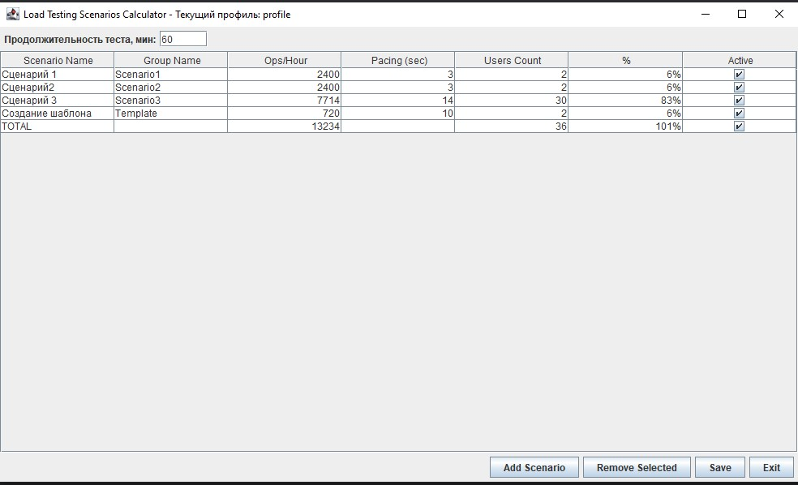
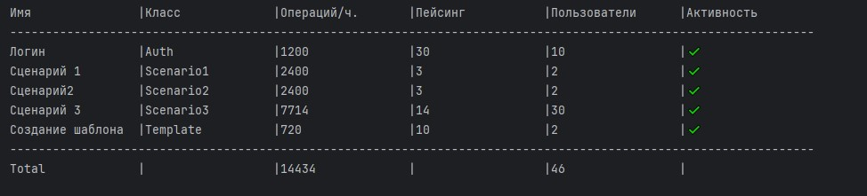

# Калькулятор Профиля Нагрузки


## 📝 Описание

Приложение для расчета параметров нагрузочного тестирования с автоматическим пересчетом взаимосвязанных метрик. Позволяет планировать распределение нагрузки между тестовыми сценариями.

## ✨ Особенности

- **Интуитивный интерфейс** на Java Swing
- **Автоматические расчеты** зависимых параметров
- **Работа с файлами** (импорт/экспорт сценариев)
- **Гибкая настройка** параметров тестирования
- **Поддержка** множества сценариев
- **Визуализация** распределения нагрузки

## 🛠 Функционал

### Управление сценариями
| Действие               | Описание                          |
|------------------------|-----------------------------------|
| Добавление             | Создание нового сценария          |
| Удаление               | Удаление выбранного сценария      |
| Редактирование         | Изменение всех параметров         |

### Параметры сценария
| Параметр          | Тип       | Расчетная формула                  |
|-------------------|-----------|------------------------------------|
| Operations/Hour   | Integer   | `(3600 / Pacing) * Users Count`    |
| Users Count       | Integer   | `Operations/Hour / (3600 / Pacing)`|
| % Load           | Integer   | `(Users Count / Total Users) * 100`|

### Ключевые возможности
- Автоматический пересчет при изменении данных
- Валидация вводимых значений
- Суммирование показателей активных сценариев
- Поддержка работы с файлами (формат CSV)

## 📦 Установка

1. Требования:
    - Java 17+
    - Maven 3.6+

2. Сборка:
```bash
mvn clean package
```

4. Подключение к проекту Gatling:
 - Добавить LoadCounter.jar в classpath проекта
5. Запуск:
```java
public class ProfileUiApp {
    public static void main(String[] args) {
        LoadCalcApp.main(new String[] {"path/to/profile/folder"});
    }
}
```


# Класс Profiler

## 📝 Описание

- Класс для работы с созданными профилями нагрузочного тестирования.
- Загружает профили из файла и предоставляет методы для получению данных по каждому сценария, для запуска тестов.
- Названия файла с профилем должно быть идентично названию класса в котором запускается сценарий нагрузки 

## Конструктор

### `Profiler(String path)`
Инициализирует профиль из указанного файла.

**Параметры:**
- `path` - путь к файлу профиля

**Пример интеграции с Gatling:**
```java
 //Определяем класс запущенной симуляции в зависимости от окружения getenv - локальный запуск, getProperty - ci
static String currentSimulationClass=System.getenv("SIMULATION_CLASS")==null?System.getProperty("gatling.simulationClass"):System.getenv("SIMULATION_CLASS");

//Достаем имя класса отбрасывая пакет
static String currentSimulationName= Arrays.stream(currentSimulationClass.split("\\.")).reduce((first, second) -> second)
        .orElse(null);

//Создаем profiler из одноименного файла
public static Profiler profiler = new Profiler("src/test/resources/profiles/"+currentSimulationName+"Profile.txt");
```

# Методы
### `Integer getUserCount(String scenarioName)`

**Описание:**  
 - Возвращает количество виртуальных пользователей для указанного сценария нагрузочного теста.


**Возвращаемое значение:**
- `Integer` - количество пользователей (≥0)
- `-1` - если сценарий не найден

**Особенности:**
- Поиск осуществляется по точному совпадению поля `className` объектов `Scenario`
- Возвращает первое найденное значение (если в профиле есть дубликаты классов)
- Не учитывает флаг активности сценария (`isActive`)

**Пример использования:**
```java
Population Builder test = someTest.injectOpen(rampUsers(profiler.getUserCount("имя сценария")).during(...)

```

### `int getScenarioPace(String scenarioName)`

**Описание:**  
 - Возвращает интервал между итерациями (пейсинг) для указанного сценария в секундах.


**Особенности поведения:**
- ❗ Чувствителен к регистру при сравнении имён классов
- ⏱ Возвращает значение из поля `pacingTime` без дополнительных вычислений
- 🔍 Проверяет только первое совпадение (если в профиле дублируются классы)

**Пример использования:**
```java
Profiler testProfile = new Profiler("scenarios.conf");
int pacing = testProfile.getScenarioPace("com.test.AuthService");

if (pacing == -1) {
    log.error("Сценарий AuthService не настроен в профиле");
} else {
    log.info("Интервал выполнения: {} сек", pacing);
}

```

### `Integer getTestDurationInMinutes()`

**Описание:**  
- Возвращает общую продолжительность нагрузочного теста в минутах, прочитанную из файла профиля.

**Сигнатура метода:**
```java
public Integer getTestDurationInMinutes()

```

### `void printScenariosAsTable()`

**Описание:**  
- Выводит в стандартный вывод (консоль) форматированное табличное представление всех сценариев нагрузочного теста, включая итоговые показатели.
- Рекомендуется выполнять перед запуском теста в фикстуре @Before
```java
public void before(){
        System.out.println("Профиль: "+this.getClass().getSimpleName());
        System.out.println("Длительность : "+profiler.getTestDurationInMinutes()+" минут");
        profiler.printScenariosAsTable();
    }
```


